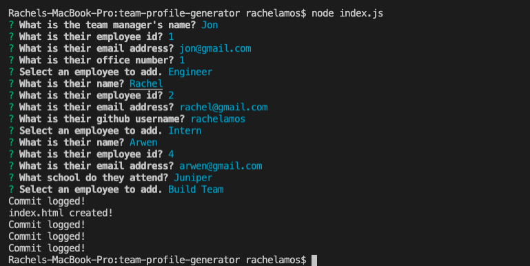
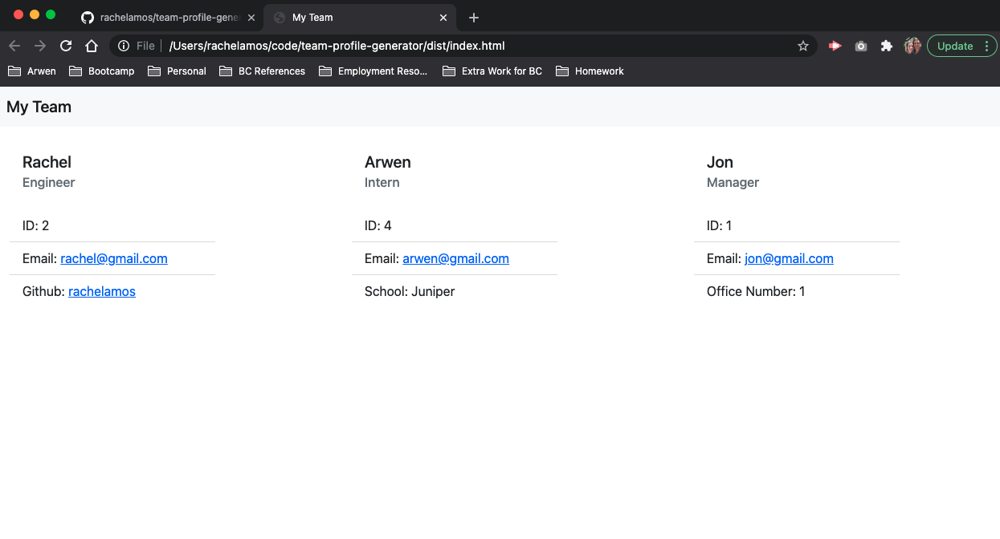

# Team Profile Generator
## Table of Contents

1. [Description](#description)
2. [Installation](#installation-instructions)
3. [Usage](#usage)
4. [Contributing](#contributers)
5. [License](#license)

### Description
A Node.js command-line application that takes user input to create an HTML page showcasing the team members of a software engineering team.

Unit test can be run with Jest.

### Installation Instructions
1. Download the code from the repo.
2. Within the terminal, npm i.
3. Run node index.js.
4. Input the answers to the prompts.

### Usage
From the terminal, answer the prompt questions. The app will generate an HTML page showcasing your team members.

**Application in Terminal**

**Final Product**

[Link to Application](https://github.com/rachelamos/team-profile-generator)

[Demo of My App](https://drive.google.com/file/d/1iuJ72cqOuOx8xT6BMSCnbRZ-ejgK26WY/view)

### Questions
If you have any other questions, you can reach me:
- via email: rachelamos35@gmail.com
- via GitHub: https://github.com/rachelamos

### License
This project is covered under the [MIT](LICENSE) license.

### Contributers
© Rachel Amos